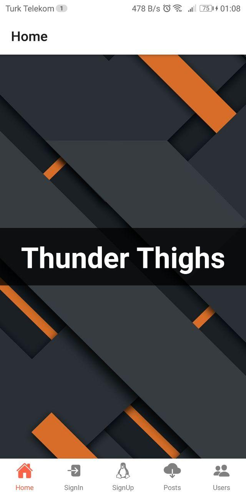
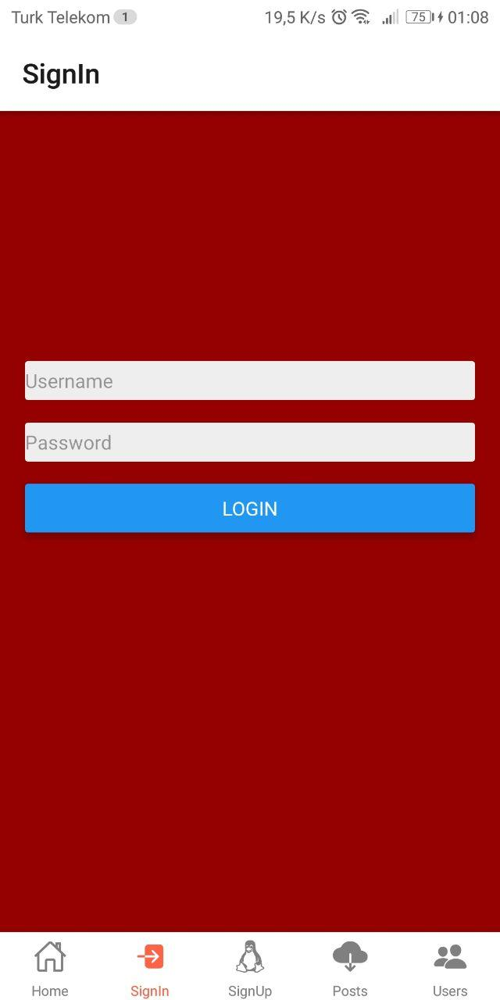
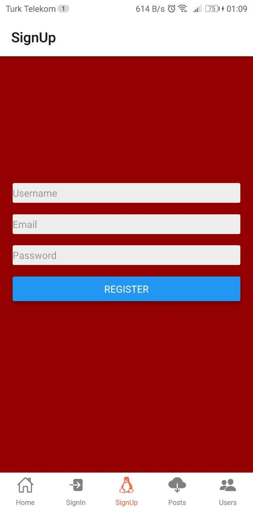
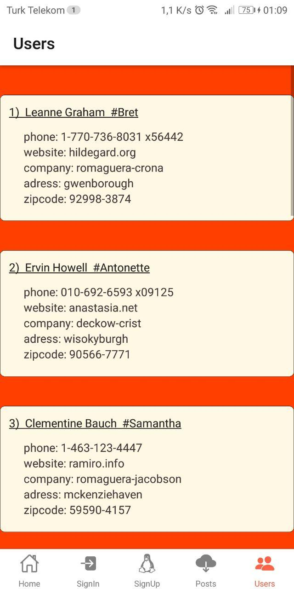

# 3. Week - React Native App

- Login ve Menu kısımlarının bulanacağı React Native App oluşturulacak
- JSONPlaceholder API ve axios kullanarak postlar listelenecek
- Son tarih: 20.02.2022 14:00

